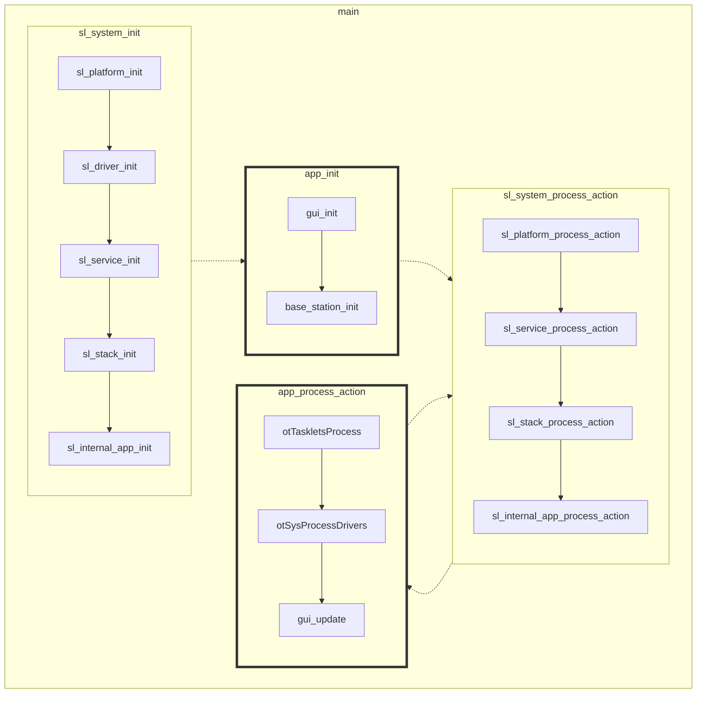
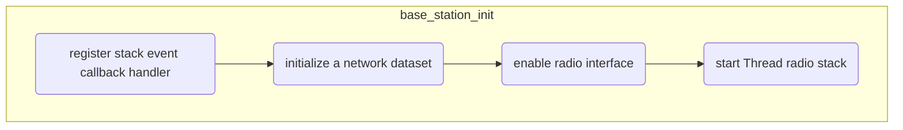

# OpenClicker Base Station

## Introduction

OpenClicker Base Station is a standalone Constrained Application Protocol (CoAP) server example running the OpenThread (OT) stack on EFR32.

> This project is designed to be used in tandem with one or more devices running the [OpenClicker Remote](https://github.com/silabs-nino/openclicker_remote) project.

The project serves to demonstrate how to develop applications on top of the OT stack and covers the following concepts:

- Forming a Thread network
- Commissioning through a pre-shared key (pSKD)
- Initializing a CoAP Server
- Processing network events
- Processing CoAP events

OT prioritizes network stability over network hierarchy and thus there is no explicit mechanism available to make a device assume a specific role or type (e.g. router, ED, leader, etc.). For this reason the network could be assembled in any manner, wherein the "base station" need not be the network leader (unlike STAR network topology). Figure 1.1 and Figure 1.2 depict different possible network arrangements.

```
┌────────────────────────────────────────────────────────────────────────┐
│                                                                        │
│            ┌ ─ ─ ─ ─                           ┌ ─ ─ ─ ─               │
│              remote │◀┐                          remote │              │
│            └ ─ ─ ─ ─  └─┐                      └ ─ ─ ─ ─               │
│                         └─┐                    ▲                       │
│                           └─┐                 ┌┘                       │
│                             ▼                 ▼                        │
│                        ┏━━━━━━━━┓    ┏━━━━━━━━┓           ┌ ─ ─ ─ ─    │
│                        ┃ remote ┃◀──▶┃ remote ┃◀─────────▶  remote │   │
│ ┌ ─ ─ ─ ─              ┗━━━━━━━━┛    ┗━━━━━━━━┛           └ ─ ─ ─ ─    │
│   remote │◀┐           ▲                      ▲                        │
│ └ ─ ─ ─ ─  └─┐        ┌┘                      └┐                       │
│              ▼        ▼                        ▼                       │
│              ┏━━━━━━━━┓                        ┏━━━━━━━━┓              │
│              ┃ remote ┃                        ┃ remote ┃              │
│              ┗━━━━━━━━┛                        ┗━━━━━━━━┛              │
│              ▲        ▲                        ▲        ▲              │
│ ┌ ─ ─ ─ ─  ┌─┘        └┐                      ┌┘        └┐             │
│   remote │◀┘           ▼                      ▼          │             │
│ └ ─ ─ ─ ─              ┏━━━━━━━━━━━━━━━━━━━━━━┓          └┐ ┌ ─ ─ ─ ─  │
│                        ┃     Base Station     ┃           └▶  remote │ │
│                        ┗━━━━━━━━━━━━━━━━━━━━━━┛             └ ─ ─ ─ ─  │
│                        ▲                      ▲                        │
│                       ┌┘                      └┐                       │
│                       ▼                        ▼                       │
│              ┌ ─ ─ ─ ─                         ┌ ─ ─ ─ ─               │
│                remote │                          remote │              │
│              └ ─ ─ ─ ─                         └ ─ ─ ─ ─               │
│                                                                        │
│                                       ┌──────────────────────────────┐ │
│                                       │legend                        │ │
│                                       │┏━━━━━━━━━━━━┓ ┌ ─ ─ ─ ─ ─ ─  │ │
│                                       │┃   router   ┃   end device │ │ │
│                                       │┗━━━━━━━━━━━━┛ └ ─ ─ ─ ─ ─ ─  │ │
│                                       └──────────────────────────────┘ │
│                                                                        │
│                Figure 1.1: OpenThread Network Topology                 │
└────────────────────────────────────────────────────────────────────────┘
```

```
┌────────────────────────────────────────────────────────────────────────┐
│                                                                        │
│            ┌ ─ ─ ─ ─                           ┌ ─ ─ ─ ─               │
│              remote │◀┐                          remote │              │
│            └ ─ ─ ─ ─  └─┐                      └ ─ ─ ─ ─               │
│                         └─┐                    ▲                       │
│                           └─┐                 ┌┘                       │
│                             ▼                 ▼                        │
│                        ┏━━━━━━━━┓    ┏━━━━━━━━┓           ┌ ─ ─ ─ ─    │
│                        ┃ remote ┃◀──▶┃ remote ┃◀─────────▶  remote │   │
│ ┌ ─ ─ ─ ─              ┗━━━━━━━━┛    ┗━━━━━━━━┛           └ ─ ─ ─ ─    │
│   remote │◀┐           ▲                      ▲                        │
│ └ ─ ─ ─ ─  └─┐        ┌┘                      └┐                       │
│              ▼        ▼                        ▼                       │
│              ┏━━━━━━━━┓                        ┏━━━━━━━━┓              │
│              ┃ remote ┃                        ┃ remote ┃              │
│              ┗━━━━━━━━┛◀┐                    ┌▶┗━━━━━━━━┛              │
│              ▲          └─┐                ┌─┘          ▲              │
│ ┌ ─ ─ ─ ─  ┌─┘            └─┐            ┌─┘            └┐             │
│   remote │◀┘                └▶┏━━━━━━━━┓◀┘               │             │
│ └ ─ ─ ─ ─                     ┃ remote ┃                 └┐ ┌ ─ ─ ─ ─  │
│                               ┗━━━━━━━━┛                  └▶  remote │ │
│                               ▲        ▲                    └ ─ ─ ─ ─  │
│                              ┌┘        └┐                              │
│                            ┌─┘          └─┐                            │
│                          ┌─┘              └─┐                          │
│         ┌ ─ ─ ─ ─ ─ ─ ─ ◀┘                  └▶┌ ─ ─ ─ ─                │
│           Base Station │                        remote │               │
│         └ ─ ─ ─ ─ ─ ─ ─                       └ ─ ─ ─ ─                │
│                                                                        │
│                                       ┌──────────────────────────────┐ │
│                                       │legend                        │ │
│                                       │┏━━━━━━━━━━━━┓ ┌ ─ ─ ─ ─ ─ ─  │ │
│                                       │┃   router   ┃   end device │ │ │
│                                       │┗━━━━━━━━━━━━┛ └ ─ ─ ─ ─ ─ ─  │ │
│                                       └──────────────────────────────┘ │
│                                                                        │
│         Figure 1.2: OpenThread Network Topology (Alternative)          │
└────────────────────────────────────────────────────────────────────────┘
```

For more information on Thread protocol or CoAP please refer to the following resources:

- [CoAP](https://coap.technology/)
- [OpenThread](https://openthread.io/)
- [OpenThread CoAP API's](https://openthread.io/reference/group/api-coap)

## Requirements

#### Software

- [Simplicity Studio v5.x (SSv5)](https://www.silabs.com/developers/simplicity-studio)
- [Gecko SDK (GSDK) v4.x](https://github.com/SiliconLabs/gecko_sdk)

#### Hardware

- WSTK Mainboard (BRD4001A)
- MG12 Radio Board (BRD4162A)

## Setup

1) Import the `SimplicityStudio/openclicker_basestation.sls` project export into SSv5.
1) Compile and Build the project.
1) Flash the binary to the MG12
    - ensure that a bootloader is present. If not, a recommendation is the `bootloader-storage-internal-single` example project.
1) Ensure that the on-board memory LCD screen shows the project GUI.

## How It Works

The base station application runs a simple CoAP server with one resource for the `answer` response. Remote nodes will send CoAP `POST` requests to update this resource. 

The project's call graph, from a high level perspective, is show in figure [Platform Loop](#platform-loop) below. User code, which initializes the thread network and application, is contained within `app_init()` and `app_process_action`.

#### Platform Loop



On boot, the device will initialize and set a new dataset which contains information on the Thread network (base_station_init). A callback handler is registered, through the otSetStateChangedCallback() API, to process stack events such as changes to the dataset, device state, or device role.

Additionally, a commissioner is started on-device so that Remote nodes with the pSKD can request to join the network. Pressing `btn0` on the WSTK when the GUI displays: `press 'B' to start` will enable the joiner. This allows any thread device with knowledge of the pSKD to join the network without needing to know the network name, channel, or authentication keys. 

The full event handler for the OpenThread stack is depicted in Figure [OpenThread Application Flow](#openthread-application-flow) below.


#### OpenThread Application Flow

```mermaid
flowchart TD
    subgraph openthread_event_handler [openthread event handler]
    subgraph dataset [ ]
        direction LR
        dataset_changed{{dataset changed}} -->|true| gui_dataset
        gui_dataset(Update GUI: Channel)
    end
    subgraph name [ ]
        direction LR
        name_changed{{network name changed}} -->|true| gui_name
        gui_name(Update GUI: Network Name)
    end
    subgraph role [ ]
        direction LR
        role_changed{{role changed}} -->|true| gui_role
        gui_role(Update GUI: Device Role) --> leader
        leader{{role == LEADER}} -->|true| commissioner
        commissioner(start commissioner) --> coap
        coap(start coap server)
    end

    dataset --- name
    name --- role

    end
```





### CoAP

Similar to the Thread stack events, OpenThread provides a callback utility for processing CoAP events. The application uses this callback functionality to parse incoming `POST` requests and respond with the acknowledgement packet, if applicable.

## Porting

Open the `.slcp` and in the "Overview" tab select "[Change Target/SDK](https://docs.silabs.com/simplicity-studio-5-users-guide/latest/ss-5-users-guide-developing-with-project-configurator/project-configurator#target-and-sdk-selection)". Choose the new board or part to target and "Apply" the changes.
> There may be dependencies that need to be resolved when changing the target architecture.